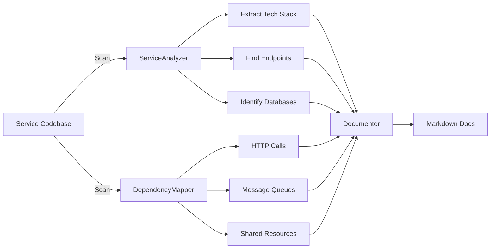

# Microservice Architect Agent 🤖

An AI-powered agent that analyzes microservice architectures and generates comprehensive documentation.

## Features

- **🔍 Service Analysis**: Automatically scans microservice codebases to extract:
  - Tech stack (Node.js, Python, Go, Java, etc.)
  - API endpoints and routes
  - Databases and message queues
  - External dependencies

- **🔗 Dependency Mapping**: Discovers connections between services:
  - HTTP inter-service calls
  - Shared databases
  - Message queue pub/sub patterns
  - External service integrations

- **📝 Documentation Generation**: Creates markdown documentation:
  - Architecture overview with Mermaid diagrams
  - Service catalog with technical details
  - API endpoint documentation
  - Dependency matrix

## Installation

```bash
# Clone the repository
git clone https://github.com/crislerwin/microservice-architect.git
cd microservice-architect

# Install dependencies
bun install

# Copy and configure environment
cp .env.example .env
# Edit .env with your API key
```

## Configuration

Create a `.env` file:

```ini
LLM_API_KEY=sk-...
LLM_BASE_URL=https://api.openai.com/v1  # Optional: Defaults to OpenAI
LLM_MODEL=gpt-4o                        # Optional: Defaults to gpt-4o
```

## Usage

### Analyze a project

```bash
# Analyze current directory
bun start

# Analyze specific project
bun start /path/to/your/microservices ./docs/output
```

### Generated Documentation

The agent generates the following files in the output directory:

| File | Description |
|------|-------------|
| `architecture-overview.md` | System architecture, tech stack, and data flow diagram |
| `service-catalog.md` | Detailed documentation for each service |
| `api-documentation.md` | API endpoints organized by service |
| `dependency-matrix.md` | Complete dependency mapping between services |

## How It Works



## Example Output

### Architecture Overview
```markdown
# Architecture Overview

## System Description
Microservices architecture with 5 services.

## Statistics
- **Total Services:** 5
- **HTTP Connections:** 8
- **Services with Database:** 4
- **Services with Messaging:** 2

## Technology Stack
- Node.js (Express, Fastify)
- PostgreSQL
- Redis
- Kafka
```

### Service Catalog
```markdown
## user-service

**Description:** User management microservice

### Technical Details
- **Stack:** Node.js, Express
- **Databases:** PostgreSQL, Redis
- **Message Queues:** Kafka

### API Endpoints
- `GET /users`
- `POST /users`
- `GET /users/:id`
```

## Project Structure

```
src/
├── agents/
│   └── MicroserviceArchitectAgent.ts    # Main agent logic
├── tools/
│   ├── ServiceAnalyzerTool.ts          # Analyze individual services
│   ├── DependencyMapperTool.ts         # Map inter-service dependencies
│   └── ArchitectureDocumenterTool.ts   # Generate documentation
├── index.ts                             # Entry point
└── ...
```

## Requirements

- [Bun](https://bun.sh/) (v1.0.0 or later)
- OpenAI API key (or compatible endpoint)

## Supported Technologies

### Languages & Frameworks
- Node.js (Express, Fastify, NestJS)
- Python (FastAPI, Flask, Django)
- Go
- Java (Spring)

### Databases
- PostgreSQL
- MySQL
- MongoDB
- Redis

### Message Queues
- Kafka
- RabbitMQ

## Contributing

1. Fork the repository
2. Create a feature branch (`git checkout -b feature/amazing-feature`)
3. Commit your changes (`git commit -m 'Add amazing feature'`)
4. Push to the branch (`git push origin feature/amazing-feature`)
5. Open a Pull Request

## License

MIT

---

Built with ❤️ using LangChain and Bun
