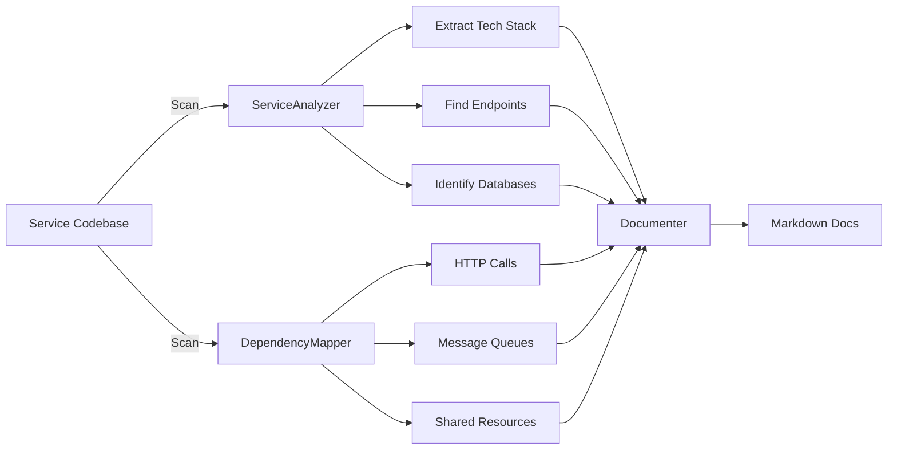

# Microservice Architect Agent 🤖

An AI-powered agent that analyzes microservice architectures and generates comprehensive documentation.

## Features

- **🔍 Service Analysis**: Automatically scans microservice codebases to extract:
  - Tech stack (Node.js, Python, Go, Java, etc.)
  - API endpoints and routes
  - Databases and message queues
  - External dependencies

- **🔗 Dependency Mapping**: Discovers connections between services:
  - HTTP inter-service calls
  - Shared databases
  - Message queue pub/sub patterns
  - External service integrations

- **📊 C4 Model Documentation**: Generates professional architecture diagrams:
  - System Context diagrams (Level 1)
  - Container diagrams (Level 2)
  - Mermaid.js compatible

- **📝 Professional Documentation**:
  - Service catalog with runbooks
  - API contracts with examples
  - Architecture Decision Records (ADRs)
  - Dependency matrix with cycle detection

- **🔍 GraphQL Federation Support**: 
  - Extract GraphQL schemas
  - Map federation relationships
  - Analyze multi-tenant database patterns

## Installation

```bash
# Clone the repository
git clone https://github.com/crislerwin/microservice-architect.git
cd microservice-architect

# Install dependencies
bun install

# Copy and configure environment
cp .env.example .env
# Edit .env with your settings (see Configuration)
```

## Configuration

### Option 1: OpenAI (Default)

```ini
LLM_API_KEY=sk-...
LLM_BASE_URL=https://api.openai.com/v1
LLM_MODEL=gpt-4o
```

### Option 2: Ollama (Local)

```ini
LLM_API_KEY=ollama
LLM_BASE_URL=http://localhost:11434/v1
LLM_MODEL=kimi-k2.5:cloud  # or any model you have
```

> 💡 **Ollama is fully supported!** Tested with kimi-k2.5:cloud model.

## Usage

### CLI (Interactive)

```bash
bun run cli
```

### Programmatic

```typescript
import { MicroserviceArchitectAgent } from "./src/agents/MicroserviceArchitectAgent.ts";

const agent = new MicroserviceArchitectAgent();

// Run full analysis
const result = await agent.runFullAnalysis(
  "/path/to/microservices",
  "./output-docs"
);

console.log(`Analyzed ${Object.keys(result.services).length} services`);
console.log(`Generated ${result.documentation.generatedFiles.length} docs`);
```

### Using ProfessionalDocumenterTool Directly

```typescript
import { ProfessionalDocumenterTool } from "./src/tools/ProfessionalDocumenterTool.ts";

const result = await ProfessionalDocumenterTool.invoke({
  projectPath: "./my-project",
  outputPath: "./docs",
  servicesData: JSON.stringify(services),
  dependenciesData: JSON.stringify(dependencies),
});

// Check generated files
console.log(result.generatedFiles);
// ['README.md', 'c4/01-context.md', 'c4/02-container.md', ...]
```

## Generated Documentation Structure

```
docs-output/
├── README.md                    # Navigation index
├── c4/
│   ├── 01-context.md           # C4 System Context diagram
│   └── 02-container.md         # C4 Container diagram
├── services/
│   └── catalog.md              # Service catalog with details
├── api-contracts/
│   ├── api-gateway.md          # API specs per service
│   ├── order-service.md
│   └── user-service.md
├── runbooks/
│   ├── api-gateway.md          # Operational guides
│   ├── order-service.md
│   └── user-service.md
├── adr/
│   └── README.md               # Architecture Decision Records
└── dependency-matrix.md        # Service dependency visualization
```

## How It Works



## Example Output

### Architecture Overview
```markdown
# Architecture Overview

## System Description
Microservices architecture with 5 services.

## Statistics
- **Total Services:** 5
- **HTTP Connections:** 8
- **Services with Database:** 4
- **Services with Messaging:** 2

## Technology Stack
- Node.js (Express, Fastify)
- PostgreSQL
- Redis
- Kafka
```

### Service Catalog
```markdown
## user-service

**Description:** User management microservice

### Technical Details
- **Stack:** Node.js, Express
- **Databases:** PostgreSQL, Redis
- **Message Queues:** Kafka

### API Endpoints
- `GET /users`
- `POST /users`
- `GET /users/:id`
```

## Project Structure

```
src/
├── agents/
│   └── MicroserviceArchitectAgent.ts    # Main agent orchestrator
├── tools/
│   ├── ServiceAnalyzerTool.ts          # Analyze individual services
│   ├── DependencyMapperTool.ts         # Map inter-service dependencies
│   ├── ArchitectureDocumenterTool.ts   # Basic documentation
│   ├── ProfessionalDocumenterTool.ts   # C4 Model + runbooks
│   ├── GraphQLAnalyzerTool.ts          # GraphQL schema analysis
│   ├── FederationMapperTool.ts         # GraphQL Federation mapping
│   └── DatabaseSchemaAnalyzer.ts       # Multi-tenant patterns
├── templates/                          # Markdown templates
│   ├── c4-context.md
│   ├── c4-container.md
│   ├── runbook.md
│   └── api-contract.md
├── index.ts                            # Entry point
└── cli.ts                              # Interactive CLI
```

## Requirements

- [Bun](https://bun.sh/) (v1.0.0 or later)
- OpenAI API key (or compatible endpoint)

## Supported Technologies

### Languages & Frameworks
- Node.js (Express, Fastify, NestJS)
- Python (FastAPI, Flask, Django)
- Go
- Java (Spring)

### Databases
- PostgreSQL
- MySQL
- MongoDB
- Redis

### Message Queues
- Kafka
- RabbitMQ

## Contributing

1. Fork the repository
2. Create a feature branch (`git checkout -b feature/amazing-feature`)
3. Commit your changes (`git commit -m 'Add amazing feature'`)
4. Push to the branch (`git push origin feature/amazing-feature`)
5. Open a Pull Request

## License

MIT

---

Built with ❤️ using LangChain and Bun
